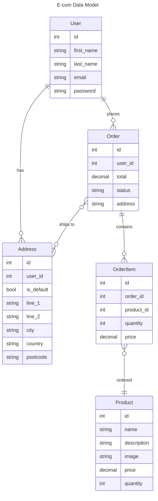
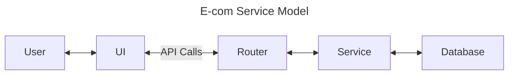

<div align="center">

[](https://go.dev/)
[](https://shields.io/badges/git-hub-last-commit)
[](https://github.com/Bilbottom/ecom-application/actions/workflows/tests.yml)

</div>

# E-commerce Application

An e-commerce application built with Go.

This is from the following YouTube tutorial:

- https://youtu.be/7VLmLOiQ3ck

The corresponding repository is:

- https://github.com/sikozonpc/ecom

## Commands

I'm on Windows (and the YouTube tutorial is not), so I can't add a Makefile. Instead, since I'm using GoLand, I am just adding run configurations.

However, the corresponding commands still need to be documented somewhere, so here they are:

```shell
# build & run
go build -o bin/ecom cmd/main.go
go run cmd/main.go

# ...alternatively, run via Docker
docker compose up --detach

# test
go test ./...

# create migration (needs the golang-migrate CLI installed)
migrate create -ext sql -dir /migrations/ <migration_name>

# migrate up/down (via Docker)
docker exec EComApp    go run cmd/migrate/main.go up
docker exec EComApp    go run cmd/migrate/main.go down
```

## Database

The database is MySQL on port `3306`. Make sure the following environment variables are set in your runtime environment:

- `PUBLIC_HOST`: `localhost` (the default is `http://localhost`)
- `DB_PORT`: `3306`
- `DB_USER`: `root`
- `DB_PASSWORD`: `password`

## REST API

Docs are made available by the following package:

- https://github.com/swaggo/swag

Check out the docs at:

- [docs/swagger.json](docs/swagger.json)

## Data and service models

### Data model



### Service model

Each service generally has a handler and a store:

- The handler is responsible for handling the request and response. This is the interface between the API and the service.
- The store is responsible for the database operations. This is the interface between the service and the database.


